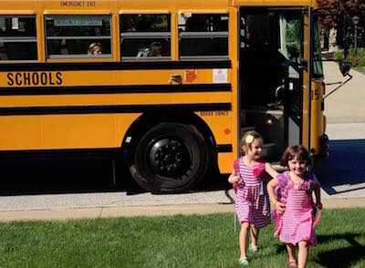
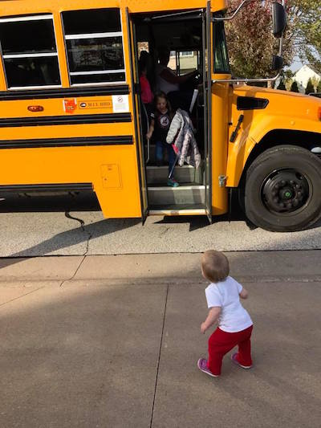

Pulling Probability Threads
========================================================
author: Tim Hoolihan
date: 12/14/2016
autosize: true
Presented to the [Cleveland R User Group](https://www.meetup.com/Cleveland-useR-Group/)

Warning
========================================================
- this talk meandors on purpose
- there are intentional mistakes that correct later
- some code re-invents the wheel for demonstration purposes

Domain: Bus Stop
========================================================

Code
========================================================

Info
========================================================

- Code at [https://github.com/thoolihan/PMF_Presentation_R](https://github.com/thoolihan/PMF_Presentation_R) 
- Questions? 
  - [@thoolihan](https://twitter.com/thoolihan)
  - [tim@hoolihan.net](mailto:tim@hoolihan.net)
---

